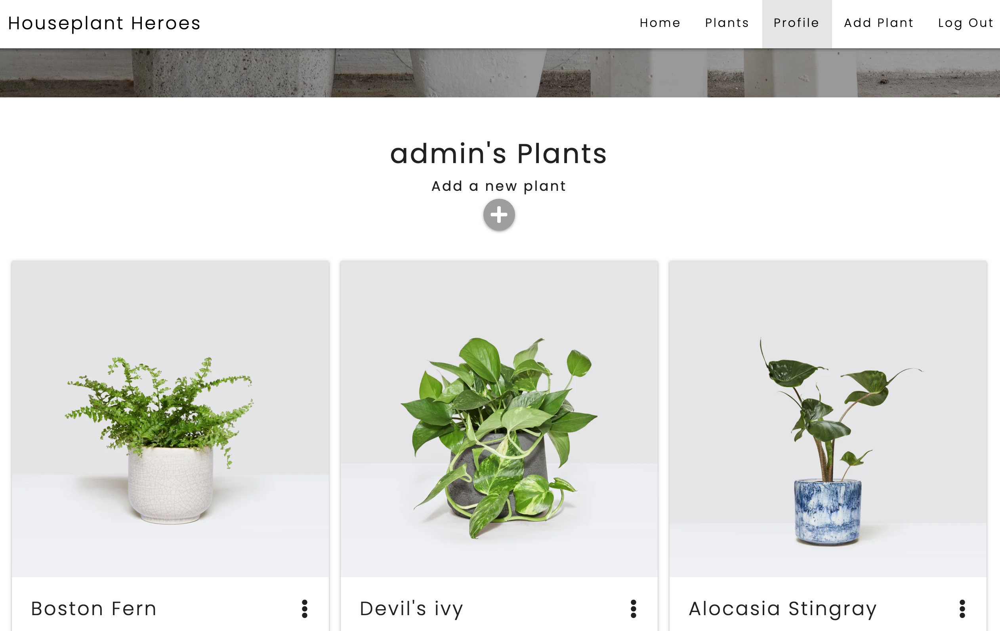

# Houseplant Heroes

## Milestone Project 3: Data Centric Development - Code Institute

[Houseplant Heroes](https://houseplant-heroes.herokuapp.com/) was created as a response to the growing popularity of houseplants which, whilst aesthetically pleasing can often be difficult to maintain! The website allows users to access information on houseplant care as well as contribute their own insights and experiences.

## Table of Contents

1. 

UX

   - [User Stories](#user-stories)

     - [First Time User Goals](#first-time-user-goals)
     - [Returning User Goals](#returning-user-goals)
     - [Frequent User Goals](#frequent-user-goals)
     - [Site Owner Goals](#site-ownner-goals)

   - [Design](#design)
     - [Colour Scheme](#colour-scheme)
     - [Typography](#typography)
     - [Imagery](#imagery)
     - [Icons](#icons)
     - [Layout](#layout)
     - [Styling](#styling)
     - [Wireframes](#wireframes)
         

2. 

Features

   - [Existing Features](#existing-features)

     - [Elements on every page](#elements-on-every-page)
     - [Homepage](#homepage)
     - [Plants Page](#plants-page)
     - [Plant Profile Page](#plant-profile-page)
     - [Login Page](#login-page)
     - [Join Page](#join-page)
     - [User Profile Page](#user-profile-page)
     - [Add Plant Page](#add-plant-page)
     - [Edit Plant Page](#edit-plant-page)

   - [Features Left to Implement](#features-left-to-implement)
     

3. 

Information Architecture
   

   - [Database Choice](#database-choice)

   - [Collections Data Structure](#collections-data-structure)

   

4. 

Technologies Used
   

   - [Languages](#languages)

   - [Frameworks, Libraries & Programs Used](#frameworks,-libraries-&-programs-used)
   

5. 

Testing
   

   - [testing.md](./testing.md)

   

6. 

Deployment
   

   

7. 

Credits
   

   

# UX

## User Stories

### First Time User Goals

1. As a First Time User, I want to easily understand the purpose of the website and the services it offers
2. As a First Time User, I want to be able to navigate intuitively through the site

### Returning User Goals

1. As a Returning User, I want to browse plants
2. As a Returning User, I want to search for plants
3. As a Returning User, I want to know which plants are easiest/most difficult to care for
4. As a Returning User, I want ask questions about the plants
5. As a Returning User, I want to find care instructions
6. As a Returning User, I want to create my own posts

### Frequent User Goals

1. As a Frequent User, I want to see the plants that I have posted
2. As a Frequent User, I want to edit and delete my posts
3. I want to discuss the plants with others in the community
4. As a Returning User, I want feedback on my posts

### Site Owner Goals

1. As Admin, I want the ability to edit/delete any posts deemed inappropriate or unnecessary

## Design

The overall design of the website is clean and simplistic, this allows the plants themselves to be the main focus.

### Colour Scheme

- The colours were chosen to compliment the hero image used on every page of the site. The muted tones are unobtrusive so as not to detract from the natural colours provided by the plant images.

- The add and edit plant form input uses the Materialize CSS default, on click, colours. They provide users with visually instinctual validation feedback:

Green for go

Red for stop

### Typography

- The Poppins font is used on all pages with Sans Serif as the back-up font due to it's clean presentation, the letters were also spaced apart by 2px to increase this effect.

- A range of font sizes and weights were used to denote importance.

- The white text used on the the hero image includes a text shadow to ensure readability.

### Imagery

**Hero Image**

- The hero image is used on each page of the site to create consistency and promote lasting brand image.
- The image was chosen as it emphasizes the natural aesthetic of house plants. It also isn't overly busy so as to obtrude upon the overlaid content.
- A liner gradient of (rgba(0, 0, 0, 0.4), rgba(0, 0, 0, 0.4)), is used to ensure content is visable on top.
- The hero image is resized on each page depending on the size of hero image content but is always recognisable as the same image.
- This image is coded as a background-image in css and set to background-size: cover; this making the image responsive.

**Carousel**

- A [Slick](https://kenwheeler.github.io/slick/) Carousel is used to display the most recently added posts on the homepage.

- The carousel image links to the plant post for easy navigation for users.

- The carousel also states who the plant was posted by. The username was included to encourage users to post their own plants to be displayed on the front page.

- Lazy loading is used to postpone loading of images outside the browser viewport, decreasing loading time.

- The decision to use slick was purely aesthetic as the carousel provided by Materialize CSS appeared either too big or too small and were rigid in their customisability.

### Icons

Icons are used throughout the site to provide the user with visual cues and create a more interesting aesthetic.

- The use of icons in the plant profile page are particularly important as there may be quite a lot of information for the user to digest. The icons allow the user to easily scan the page for the information they are looking for. They also break up the information to make it more manageable for the user.

- Arrow and Chevron icons are used throughout, with hover, to indicate directional links.

- A [Plant Pot](https://icons8.com/icon/106115/potted-plant) icon from [Icons8] is used for the site favicon to distinguish the website from other tabs sites for the user. The icon is also used in the footer for consistency.

- Social media icons are clearly positioned within the footer in accordance with user expectations. Dead links are used as the social media pages to exist at present.

### Layout

- [Materialize CSS Grid](https://materializecss.com/grid.html) was used to created the layout and make it responsive. The layout is simplistic, with no overcrowding of objects. This ensures users are able to clearly see and access the information they are looking for. Use of clean lines adds to this effect.

- A [Masonry](https://masonry.desandro.com/) grid was used to tidy up the layout of the cards in all_plants.html and profile.html. This was important as users are permitted to add images of varying dimensions, without masonry there could be large white spaces between each card.

### Styling

- [Materialize CSS](https://materializecss.com/) was used in conjunction with custom spacing and colours to provide much of the styling for the site. This includes all **buttons**, **forms**, **cards** and **nav bars**.

- [Materialize CSS Cards](https://materializecss.com/card.html) cards were utilized on all_plants.html and profile.html to display the lists of plants. They contained a condensed amount of information to allow the user to decide whether they wanted to proceed to the full care guide for the plant, for which a link is provided.

### Wireframes

- [Homepage](./static/images/readme_images/wireframes/wireframe-home.png)

- [Plants](./static/images/readme_images/wireframes/wireframe-all-plants.png)

- [Plant Profile](./static/images/readme_images/wireframes/wireframe-plant-profile.png)

- [Login](./static/images/readme_images/wireframes/wireframe-login.png)

- [Join](./static/images/readme_images/wireframes/wireframe-join.png)

- [User Profile](./static/images/readme_images/wireframes/wireframe-profile.png)

- [Add Plant](./static/images/readme_images/wireframes/wireframe-add-plant.png)

- [Edit Plant](./static/images/readme_images/wireframes/wireframe-edit-plant.png)

# Features

## Existing Features

### Elements on every page

- Navbar

  - The navigation bar has the Houseplants Hero title in the top left corner for clarity

  - The navigation links are on the top right hand corner.

  - For visitors who are not logged in, the links are:
    1. Home
    2. Plants
    3. Login
    4. Join
  - For users who are logged in, the links are:

    1. Home
    2. Plants
    3. Profile
    4. Add plant
    5. Log out

  - Python checks whether a user is logged in or not with `if 'user' in session`, this data is padded to Jinja to display the correct navbar for the user.

  - For mobile, the navbar collapses in to a burger icon with side navigation on the left of the screen.

  - Active classes are added to active page to show the user what page they are currently on.

  - The nav bar is fixed to the top of the screen to allow for accessible navigation regardless are where the user is on the page. This simplicity in the design of the nav bar ensure that it is not too obtrusive for the user.

- Hero Image

  - See [Imagery](#imagery).

- Flash Messages

  - Flash messages are used to provide feedback to the user for certain actions, e.g. when a posted is updated
  - The messages are laid over the hero-image and come before the heading so they are, generally, at eye height for the user.

- Heading

  - Each page has a heading position towards the centre of the hero image. This reassures the user where they are on the site.

- Subheading

  - Each page has subheading to expand upon the purpose of the page.

- Footer
  - The footer contains:
    - Logo
    - Copywrite information
    - Social media links
    - In the future, contact information can be added

### Homepage

As the first thing the user sees, the homepage was designed to be clear and informative.

**Search Bar**

- The search bar is conveniently placed for user to start using the website straight away.
- A tool-tip explains to the user the search terms that can be used.
- In line with user expectations, users can either hit the enter key or press the search button to enter search term. This takes them to the plants page.

**Redirect Buttons**

- If the user is not logged in they will have button links for, "Plants", "Login" and "Join" pages. These (as well as the homepage) are all the pages that can be accessed when a user is not logged in. This feature is particularly targeted at first time visitors as it clearly presents them with all actions.

- Buttons are hidden on mobile due to sizing issues. See [testing](./testing.md#bugs).

**Promo Content**

- This section is for promotional purposes, providing the user with immediate information of the features of the site. The majority of which cannot be accessed without an account. This encourages user to create an account in order to have full access to these features.

- Links are provided for convenient access.

**Recently Added Carousel**

- See [Imagery](#imagery).

### Plants Page

**If users have arrived at the Plants page via the search bar on the home page:**

- If no matches have been found, a flash message will be displayed to user "No results. Please try again or browse all plants below." With all plants displayed below.

- If a match has been found, the user will be presented with their search results.

**Search Bar**

- See Search Bar in [Homepage](#Homepage)

**Search Bar Reset Button**

- Resetting the search results displays all plant posts in the database, eliminating the need for the user to refresh or go back.

**Cards List**

- See [Layout](#layout) and [Styling](#styling)
- Posts are sorted newest first

### Plant Profile Page

User's arrive on this page following a link from either the All Plants Page or User Profile Page card lists.

**Hero Image Content**

- Contains content to assure the user they are on the plant they expected

- The plant nickname is used as the page header at it is generally the most recognisable name.

- The plant botanical name is used as the subheading

- The plant description provides a little more information the plant, it is capped at 400 characters to ensure there is no overflow.

**Plant Info**

- This section contains more detailed information on the plant.

- To the left or top of section(depending on screen size):

  - The plant image, which uses Materialize CSS's [responsive image](https://materializecss.com/media-css.html) class to ensure responsivity.
  - Shows who the plant is posted by.
  - Shows whether the plant is air purifying.
  - Shows when the plant was last updated. This initially, will show the date and time the plant was added. If the plant is edited, it will update accordingly. This was included to allow users to see whether any updates have been made since their last viewing.

- Care instructions:

  - Shows all details obtained from the add plant form.
  - Materialize layouts and icons were used to break up the information.

**Edit/Delete**

- Edit/Delete buttons are only visible if the session user matches the "posted_by" of the specific plant, or is admin.
  

- Clicking the edit button takes users to the [Edit Plant Page](#edit-plant-page).

- Clicking delete triggers a defensive modal:
  
  1.  If yes, delete:
      - the plant post is removed from the database and the modal is closed.
  2.  If no, keep:
      - the modal is closed immediately, cancelling the action and the plant post remains in the database.

**Comments**
The comments section allows users to leave comments about specific plants. The aim is to increase user engagement and stimulate conversation.

- All comments show username and date/time posted

- Comments are displayed, oldest to newest. This decision was based on [this post](https://ux.stackexchange.com/questions/38002/display-comments-order-best-practice) from Ux Stack Exchange in which it is concluded that reverse chronological order is more conducive to natural conversation.

- If no user is logged in they will see:
  

  - The user must be logged in to comment as it shows who the comment is posted by to increase and accountability and allow for more developed conversation.
  - Comments are visible to all visitors as they provide further information and encourage visitors to make an account.

- If user is logged in they will see:
  

  - The input field is limited to 350 characters so that they are easy for readers to digest.

- The delete buttons is only visible if the session user matches the "posted_by" of the specific comment, or is admin.

- The ability to edit the comment was removed as editing a comment may change the flow of conversation or cause confusion.

### Login Page

**Form**

- The login page features a simple form for user to enter their username and password.

- Python checks whether the password and passwords match what is held in the database.

- If both are correct:

  - user is directed to their profile page.

- If either or both are incorrect:
  - flash message is displayed "Incorrect username and/or password please try again.". It is not specified which is incorrect to increase security.

**Redirect Links**

- A link for the join page is provided "New? Join here ->" in case the user has found themselves in the wrong place and needs redirecting.

### Join Page

**Form**

- Similarly, to the login page, a simple form is used for the user to enter a desired username and password.

- If the chosen username already exists in the database (checked by Python):

  - flash message will appear, "Username already in user, please try another".

- Users are asked to confirm password, (checked by Python). If the passwords don't match a flash message is displayed, "Passwords don't match, please try again"

- Tooltips are used to tell users what is required for a valid username and password.

- If user input does not meet requirements:

  - input field will be underlined in red, see (colour scheme)[#colour-scheme].
  - on submit, they will not be permitted to proceed.

- If user input meets all requirements:

  - input field will be underlined in green, see (colour scheme)[#colour-scheme].
  - on submit, user will be directed to their newly created profile page.

**Redirect Links**

- A link for the login page is provided "Already have an account? Login ->" in case the user has found themself in the wrong place and needs redirecting.

### User Profile Page

<i>Unable to provide responsive image due to necessity for session cookie</i>

- The main purpose of the user profile page is to allow the user to see a list of the plants that they have posted. Users have the ability to edit and delete their own posts and this gives them easy access to do so.

**Hero Image Content**

- The heading welcomes the user

- The subheading directs users to look at their plants or add a new one

**User's Plants list**

- If the user has no plants to show they will see:
  

  - The add button takes users to the [Add Plant Page](#add-plant-page).

- If the user has already added plants they will see a list of their plants:
  
  - A link to add [Add Plant Page](#add-plant-page) is included to encourage users to continue adding plants.
  - Cards are used to display the list of user's plants. See [Layout](#layout) and [Styling](#styling).

### Add Plant Page

**Hero Image Content**

- The subheading reassures users that they will be able to edit or delete their plant should the wish to later. This was include so that user's do not over-think their posts.

**Form**

- The form asks users to input information on their plants

- Feedback is provided to the user by underlining in either green or red, see (colour scheme)[#colour-scheme]. The form will not be submitted until everything is green.

- As MongoDB, alone, is not capable of storing images. User's are asked to paste an imaged url instead. A tooltip provides instructions on how to do this.

- A switch is used for the "Is the plant air purifying" as it can only be yes or no.

- A dropdown selection is used for the maintenance level in order to limit the user input. This makes it easier for user's to search plants by maintenance level as it can only have three specific terms: easy, medium and hard. Materialize CSS does not provide validation for select options so a jquery method was taken from [this](https://stackoverflow.com/questions/34248898/how-to-validate-select-option-for-a-materialize-dropdown) stack overflow answer from user Imran Saleem.

- The add button submits the form, adding the post to the database.

### Edit Plant Page

The edit plant page is almost identical to the add plant page (above) with a few exceptions:

- All form information is prefilled with the current plant information, this allows users to edit only edit small amounts if necessary.

- There is both an edit and cancel button at the end of the form:
  - The edit button submits the form. Updating the current post in the database and returning the user back to the plant's profile page, with the newly updated information.
  - The cancel button returns the user back to the plant's profile without any change.

## Features Left to Implement

1. User password reset

   - Allow user's the ability to reset their password if forgotten

2. Pagination

   - Pagination is needed on the Plants and User Profile pages.
   - At present this is not necessary as there are so few plants but as the database grows the results per page should be limited. This will decrease loading time.

3. Autofill of search input

   - This would provide user's with guidance of search terms.

4. Favourite Plant Button

   - To allow user's to have a list of their favourites displayed on their profile page.

5. Plant Tracking Dashboard

   - Eventually, I would like to implement a plant tracking system.
   - This would allow users to input information and track their plants in their profile page.
   - E.g. a "water plant" button would remind user's of the last time they watered their plants.
   - This type of information is likely more suited to an SQL database.

6. Reply to comment

   - Reply to a specific comment in the comments section to aid ability to answer questions

7. Comment/Post Deleted By

   - I would like a message to display to users when a comment or post has been deleted.
   - This would eliminate any potential confusion caused by deletion.

8. Back-end Validation

   - Materialize CSS forms provide front-end validation but back-end validation would be ideal to ensure posts are entered and added correctly to the database.

9. Contact Page

   - A contact page would allow user's to contact admit with any questions or issues they have.

10. Admin Dashboard

    - Increase admin's capabilities to manage the site.
    - Allow admin to delete or contact users directly.

11. Sort by

    - User a select box on Plants Page to allow user to decide what they would like to order the posts by (currently newest first) e.g. newest first.

12. Comments Notification

    - Notify users when a plant that they have posted recieves a comment.

# Information Architecture

## Database Choice

MongoDB was chosen for its usability.

## Collections Data structure

In order to access relational data, shared inner objects were used inside the data structure:

1. Users Collection is linked to Plant_Posts Collection via username (posted_by)
2. Plant_Posts Collection is linked to Comments via plant_post_id

#### 1. Users Collection - c

| Title    | Key in db | Data type |
| -------- | --------- | --------- |
| User ID  | \_id      | ObjectId  |
| Username | username  | string    |
| Password | password  | string    |

#### 2. Plant_Posts Collection

| Title                | Key in db            | Data type |
| -------------------- | -------------------- | --------- |
| Plant Post ID        | \_id                 | ObjectId  |
| Plant Nickname       | plant_nickname       | string    |
| Plant Botanical Name | plant_botanical_name | string    |
| Plant Description    | plant_description    | string    |
| Plant Image          | plant_image_url      | string    |
| Best Environment     | best_environment     | string    |
| Water                | water                | string    |
| Humidity             | humidity             | string    |
| Feeding              | feeding              | string    |
| Is air purfiying?    | is_air_purifying     | boolean   |
| Mainenance Level     | maintenance_level    | string    |
| Posted By            | posted_by            | string    |
| Post Date            | post_date            | date      |
| Post Date String     | post_date_string     | string    |

- Two data types were included for the post date. The date version allows for back end filter functionality, the string version formats the date for the front end.

#### 3. Comments Collection

| Title            | Key in db     | Data type |
| ---------------- | ------------- | --------- |
| Comment ID       | \_id          | ObjectId  |
| Plant Post ID    | plant_post_id | string    |
| Posted at        | posted_at     | date      |
| Posted at String | posted_at     | string    |
| Posted by        | posted_by     | string    |
| Comment Body     | comment_body  | string    |

#### 4. Mainenance Level Collection

| Title               | Key in db  | Data type |
| ------------------- | ---------- | --------- |
| Mainenance Level ID | \_id       | ObjectId  |
| Level               | level_name | string    |

# Technologies Used

### Languages

- [HTML5](https://en.wikipedia.org/wiki/HTML5)
- [CSS3](https://en.wikipedia.org/wiki/Cascading_Style_Sheets)
- [JavaScript](https://en.wikipedia.org/wiki/JavaScript)
- [Python](https://www.python.org/)

### Frameworks, Libraries & Programs Used

1. [Am I Responsive](http://ami.responsivedesign.is/)

   - Was used to create images of each page displayed on different screen sizes for this readme file

2. [Font Awesome:](https://fontawesome.com/)

   - Font Awesome icons were used throughout

3. [Flask](https://flask.palletsprojects.com/en/1.0.x/)

   - Flask was used to to construct and render html pages

4. [Git](https://git-scm.com/)

   - The Gitpod terminal from Git was used to commit to Git and Push to GitHub

5. [GitHub:](https://github.com/)

   - GitHub was used to store the code after being pushed from Git

6. [Google Fonts:](https://fonts.google.com/)

   - Google fonts was used to import the ‘Poppins’ font into the style.css

7. [imagesLoaded](https://imagesloaded.desandro.com/)

   - Images loaded was used in conjunction with the masonry grid to stop unloaded images from overlapping [see here](https://masonry.desandro.com/layout.html#imagesloaded) for details

8. [Jinja](http://jinja.pocoo.org/docs/2.10/)

   - Jinja was used to displa data from the backend to the front-end displayed to the user

9. [jQuery:](https://jquery.com/)

   - jQuery was used in conjunction with MaterializeCSS for interactive components

10. [Materialize CSS](https://materializecss.com/)

    - MaterializeCSS was used for styling, components and creating responsivity on a range of devices

11. [Masonry](https://masonry.desandro.com/)

    - Masonry was used to create the cascading grid layout library when plant lists were used

12. [MongoDB:](https://www.mongodb.com/)

    - MongoDB Atlas is the database for this project

13. [PIP](https://pip.pypa.io/en/stable/installing/)

    - Pip was user to for install tools needed in this project

14. [PyMongo](https://api.mongodb.com/python/current/)

    - PyMongo was user to communicate between python and mongoDB

15. [Slick Carousel](https://kenwheeler.github.io/slick/)
    - Slick carousel was used to create the carousel on the homepage

## Testing

### See [testing.md](./testing.md)

## Deployment

## Credits

https://stackoverflow.com/questions/34248898/how-to-validate-select-option-for-a-materialize-dropdown

https://kenwheeler.github.io/slick/

### Code

### Content

### Media

- https://tinypng.com/
- background img w3schools https://www.w3schools.com/howto/howto_css_hero_image.asp
- https://realfavicongenerator.net/
