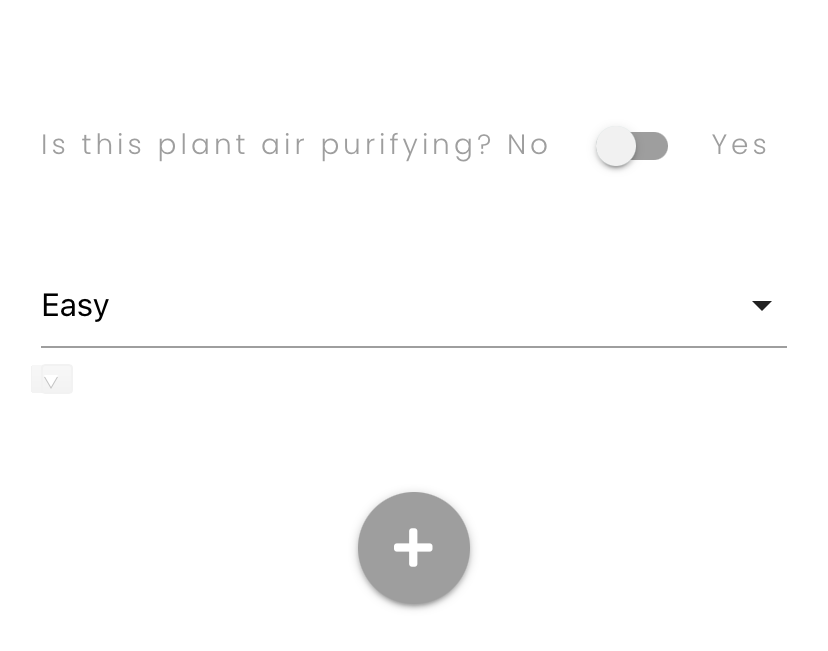

## Houseplant Heroes Testing

- [Primary README.md file](./README.md)
- [View Website](https://houseplant-heroes.herokuapp.com/)

## Table of Contents

1. [Validators](#validators)
2. [User Stories](#testing-user-stoies)
   - [First Time User Goals](#first-time-user-goals)
   - [Returning User Goals](#returning-user-goals)
   - [Frequent User Goals](#frequent-user-goals)
   - [Site Owner Goals](#site-ownner-goals)
3. [Manual Testing](#manual-testing)

   - [Devices & Browsers](#devices-tested-on)
   - [User Testing](#testing)
   - [Testing Features](#testing-interactive-elements)

4. [Bugs](#bugs)

### Validators

- HTML: [W3C Markup Validator](https://validator.w3.org/#validate_by_input)

  - The use of Jinja in the html results in a number of errors in each file, all have been reviewed and deemed acceptable.

- CSS: [W3C CSS Validator](https://jigsaw.w3.org/css-validator/#validate_by_input)

- JavaScript: [JSHint](https://jshint.com/)

- Python:
  - [PEP8](http://pep8online.com/)
  - [Gitpod](https://gitpod.io/)

### Testing User stories

#### First Time User Goals

1. As a First Time User, I want to easily understand the purpose of the website and the services it offers

   - The homepage heading clearly shows the website name, whilst the subheading provides information as to the purpose of the website "A community created guide to houseplant care."

   - The hero image clearly displays houseplants suggesting the nature of the website to the user.

   - The promo section of the homepage describes to users the main functionalities of the site.

2) As a First Time User, I want to be able to navigate intuitively through the site

   - Upon entering the site, the navigation bar is positioned at the top of the page and unobstructed by any images. This makes it easy for users to locate and read.

   - The navigation bar is fixed to the top of the screen so the user is always able to navigate wherever they are in the site.

   - In accordance with UX expectancies the logo, in the right-hand corner, navigates users back to the homepage.

   - All navigation links provide feedback to the user with hover overs, this makes them easily identifiable as links.

   - Active pages are hightlighted in the navbar to indicate to the user what page they are on.

#### Returning User Goals

1.  As a Returning User, I want to browse plants

    - If the user is logged out, buttons directing the user are visible. One of which directs users to the Plants Page.

    - The promo section of the homepage also invites users to browse all plants.

2.  As a Returning User, I want to search for plants

    - The homepage has a conveniently place search bar to allow users to start searching with out the need for redirection.

    - The search bar has a modal tip to inform users of the available search terms.

    - The Plants page also has a search bar to allow users to search from there.

3.  As a Returning User, I want to know which plants are easiest/most difficult to care for

    - Both the Plants page and the, more detailed, plant profile displays the given maintenance level of a plant.

    - Users are able to search by maintenance level: Easy, medium or hard to provide them with options within their needs.

4.  As a Returning User, I want to find care instructions

    - The plants profile provides a detailed care guide for each plant. This can be foud via links from the Plants Page card.

5.  As a Returning User, I want to create my own posts

    - The promo content on the homepage explains that an account is required to add plants.

    - Once an account has been created:

      - User will immediately be directed to their profile which contains links to add a plant

      - "Add Plant" will appear in the navbar

#### Frequent User Goals

1. As a Frequent User, I want to see the plants that I have posted

   - The user Profile Page lists the plant posts by created by the session user.

2. As a Frequent User, I want to edit and delete my posts

   - Edit and delete buttons are included on the Plant's Profile page.
   - These buttons are only visible if the post has been created by the session user or the user is Admin.

3. I want to discuss the plants with others in the community

   - The Plant Profile Pages include a comments section to allow users to leave any thoughts or queries they may have.

4. As a Returning User, I want feedback on my posts

   - The comments section allows for feedback to be given on a plant post.

#### Site Owner Goals

1. As Admin, I want the ability to delete any posts deemed inappropriate or unnecessary
   - Is the session user is "admin" delete buttons are visible on every Plant Profile that allow admin to remove that post. This is also true of comment posts.

### Manual Testing

#### Devices & Browsers

- The Website was tested on Google Chrome, Firefox, Microsoft Edge and Safari browsers.

- The website was tested on a variety of devices including; Desktop, Laptop, iPad mini, iPhone 7, iPhone 8, iPhoneX, Nokia E30 and Galaxy S20.

- It was also viewed on all devices and orientations available in Chrome DevTools.

#### User Testing

- Friends and family members viewed the site and provided feedback on bugs and UX issues.

#### Testing Features

**Elements on Every Page Desktop**

- Navbar

  - Hovering over each link confirms that the hover effect works as intended.

  - Confirmed on click:
    - **Houseplant Hero logo** takes user to homepage.
    - **Home** takes user to homepage.
    - **Plants** takes user to all_plants page.
    - **Login** takes user to login page.
    - **Join** takes user to join page.
  - Logging in, confirm that the navbar no longer displays the Log In or Join links but now displays Profile, Add Plant and Log Out.

  - Confirmed on click:
    - **Profile** takes user to their profile page.
    - **Add Plant** takes user to the add_plant page.
    - **Logout** triggers function to remove session user, logging them out and reverting navbar to logged out configuration.

- Active page is highlighted.

- Hero Image

  - Confirm that hero image loads at a reasonable speed, and that the image is clear.
  - Confirm that hero image is an appropiate size for inner content.
  - Confirm that content is easy to read.

- Flash messages

  - Confirm that a flash message appears if:

    - A user searches for a plant post and no matches are found.
    - A user tries to create a username that already exists in the database.
    - A user's password and confirm password do not match.
    - Either the password or username is incorrect.
    - Both the password and username are incorrect.
    - A user logs out.
    - A user adds a plant.
    - A user updates/edits a post.
    - A user deletes a post.
    - A user posts a comment.
    - A user deletes their comment.

  - Confirm that flash messages are clear and easy to read.

- Footer

  - Hovering over social links confirm that the hover effect works as intended.

**Elements on Every Page Mobile**

- Confirm that navbar collapses in to burger icon.

- Confirmed on click:
  - **Houseplant Hero logo** takes user to homepage.
  - **Burger icon** triggers side nav.
  - [**Same as Above for Desktop**](####testing-features)

**Homepage**

- Search bar

  - Confirm that users are able to search by maintenance_level, plant_nickname or plant_botanical_name.
  - Confirm that search returns matching results.
  - Confirm that users are alerted if no matches are found and all plants are displayed.

- Redirect Buttons

  - Confirm that buttons are only visibly if user is logged in.
  - Confirm that buttons are not visible on mobile.
  - Confirmed on click:
    - **Plant** takes user to all_plants.
    - **Login** takes user to login.
    - **Join** takes user to join.

- Promo Content

  - Confirmed on click:
    - **Browse Plants** takes user to all_plants.
    - **Login** takes user to login.
    - **Join** takes user to join.

- Carousel

  - Confirm that images render correctly.
  - Confirm that plant_nickname and posted_by is correct.
  - Confirm that newest plant posts are inserted in to carousel by adding a new plant.
  - Confirm that clicking an image takes user to that plant's profile page.

**Plants Page**

- Search bar
- See homepage Search Bar above.

- Confirm that matching results are rendered correctly.

- Search Bar Reset Button

- Confirm that clicking displays all plants.

- Plant Cards
  - Confirm that all cards are laid out correctly by adding a plant.
  - Confirmed on click:
    - Image brings up more information on the plant.
    - **Care guide** link takes user to the plant's profile page.

**Plant Profile Page**

- Hero Image Content

  - Confirm hero image content has been correctly insterted from plant_post database.

- Plant Info

  - Confirm content has been correctly insterted from plant_post database.
  - Confirm that the plant image is responsive on a range of devices.
  - Confirm that **last updated** changes if plant is edited.

- Edit/Delete

  - Confirm that icons are only visible if session user matches posted_by in plant_post.
  - Confirmed on click:
    - **Edit Icon** takes user to edit_plant page.
    - **Delete Icon** triggers modal that ask user to confirm that they want to delete post:
      - No, keep closes modal with no further actions.
      - Yes, delete deletes takes user to all_plants with a flash message.
  - Confirm that post and related comments have been removed by checking the MongoDB for plant_posts.

- Comments

  - Confirm that users are unable to comment unless they are logged in:
    - Confirm on click:
      - Login takes user to login page
      - Join takes user to join page
  - Confirm that is users are logged in they see an input area.
    - Confirm on click:
      - Add button refreshes page with message and newly added comment.
  - Confirm that delete icon is only visible if session user matches posted_by in comments:
    - Confirm on click:
      - Delete removes post.
  - Confirm that comment has been deleted by checking MongoDB comments collection.

**Login Page**

- Form

  - Confirm that the log in form is displayed correctly.

  - Confirm that user is not logged in and a flash message appears if on click of **login**:

    - Either the password or username is incorrect.
    - Both the password and username are incorrect.

  - Confirm that user is logged in and redirected on click of **login** to their profile page if:
    - The username matches the hashed password in the database.

- Redirect Links

  - Confirm that **New? Join here ->** takes user to join page.

- Confirm that user is logged in by checking that session data can be seen in developer tools.

**Log Out**

- Confirm on click of **logout** in navbar that user is redirected to login.

- Confirm that logout was successful by checking that no session data can be seen in developer tools.

**Join Page**

- Form

  - Confirm that the join form is displayed correctly.

  - Confirm that an account is not created and a flash message appears if on click of **join** if:

    - The chosen username already exists in the database.
    - The password and confirm password do not match.
    - Input does not match requested format.

  - Confirm that if all requirements are met, on click of **join**, an account is created and the user is taken to their profile page.

- Confirm that account has been created by check the MongoDB users collection.

- Redirect Links
  - Confirm that **
    Already have an account? Login ->** takes user to join page.

**User Profile Page**

- Hero Image Content

  - Confirm that username is inserted in to heading.
  - Confirmed on click that the chevron takes user to their list.

- User's Plants list

  - Confirmed that if user has no plants they will be shown a differed to message to if they do.
  - Confirm that users are only show plant posts that they have created.
  - Confirmed on click:
    - Add button takes user to add_plant page.

- Cards
  - See Plant Cards in Plants Page above.

**Add Plant Page**
- Confirm that all requirements must be met before a post is added.

- Confirm that all data is gathered correctly by checking MongoDB. 

**Edit Plant Page**
- Confirm that all requirements must be met before a post is edited.

- Confirmed on click: 
   - Cancel button returns the user back to the plant's profile without any change.
   - Edit button submits form and returns user to plant_profile. 

- Confirm that all data is updated correctly by checking MongoDB. 

**404 Page**
- Confirm that user is taken to 404 page by typing an incorrect url into the browser.
- Confirmed on click:
  - **Home** link takes user to homepage
  - **Plants** link takes user to all_plants 

### Bugs

- When adding a plant on IOS mobile devices, a double caret appears:

  - After extensive research I found that the second caret could be removed with [CSS](https://stackoverflow.com/questions/34804562/materialize-select-input-shows-two-carets): 
  `.caret {
  border-color: transparent !important;
}`
  - However, there is a known bug with the Materialize select on touch IOS see [here](https://github.com/Dogfalo/materialize/issues/6449) that makes selection difficult. 

   - I made the decision to pick substance over style and keep both carets visible as the second caret is effective. This users the ability to select but may cause confusion. 

  - A fix for this has been established [here](https://github.com/Dogfalo/materialize/commit/c0da34049deec36efbd4681f73b3446e92918ca8) but was beyond the scope of this project. I've left it here to be implemented in the future. 

- In the add_plant and edit_plant forms, labels exeding two lines (just 'humidity' in this project) cause an overlapping issue:

  - As the bug is purely aesthetic and does not cause any input issues, it has been left for now as overriding Materialize CSS can be fiddly. But should be addressed in the future. 

- Occasionally, the carousel on the homepage shows alt images when the whole image is not in view (to the left or right). This is due to the inclusion of lazy loading which decreases loading time and can therefore be removed depending on the client's priorities. 
 
- On the Join Page, the username min-length seems to cap characters at one above the stated. To get around this I set the min-length to 3 characters but instructed users to create a username with a min-length of 4 characters.

